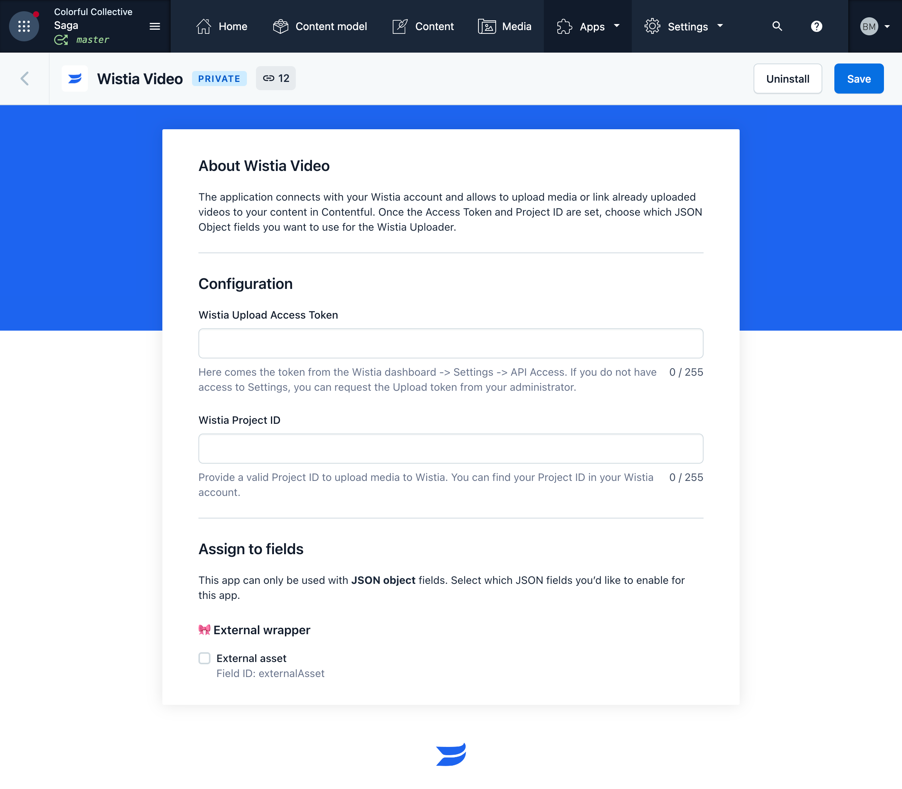
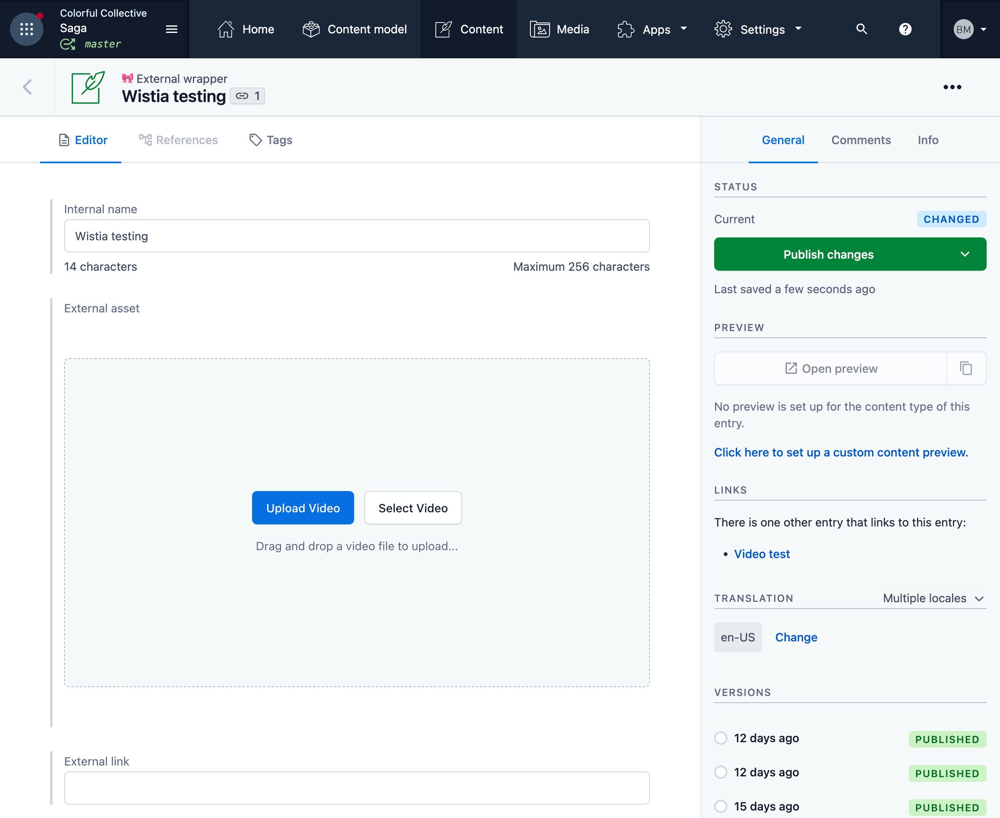
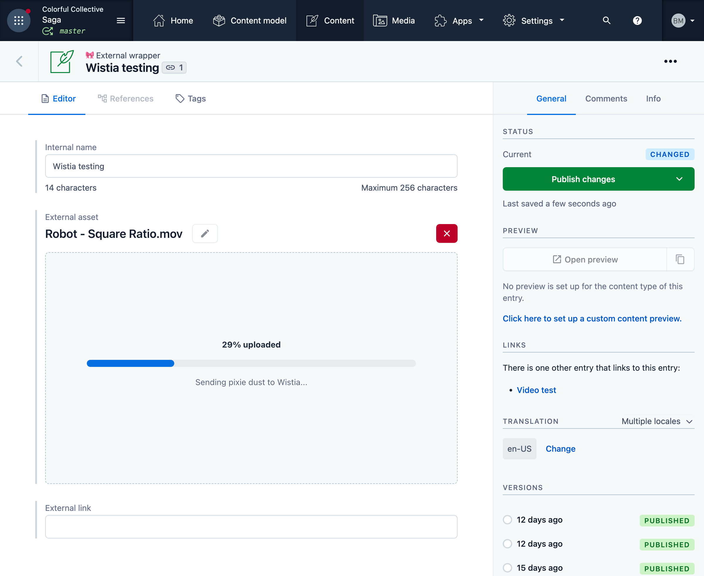
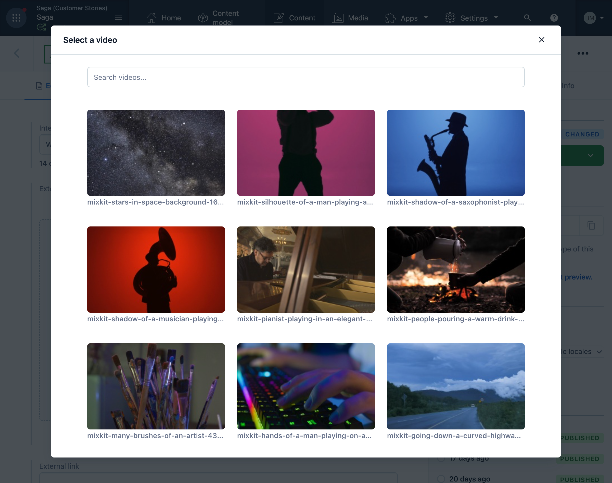
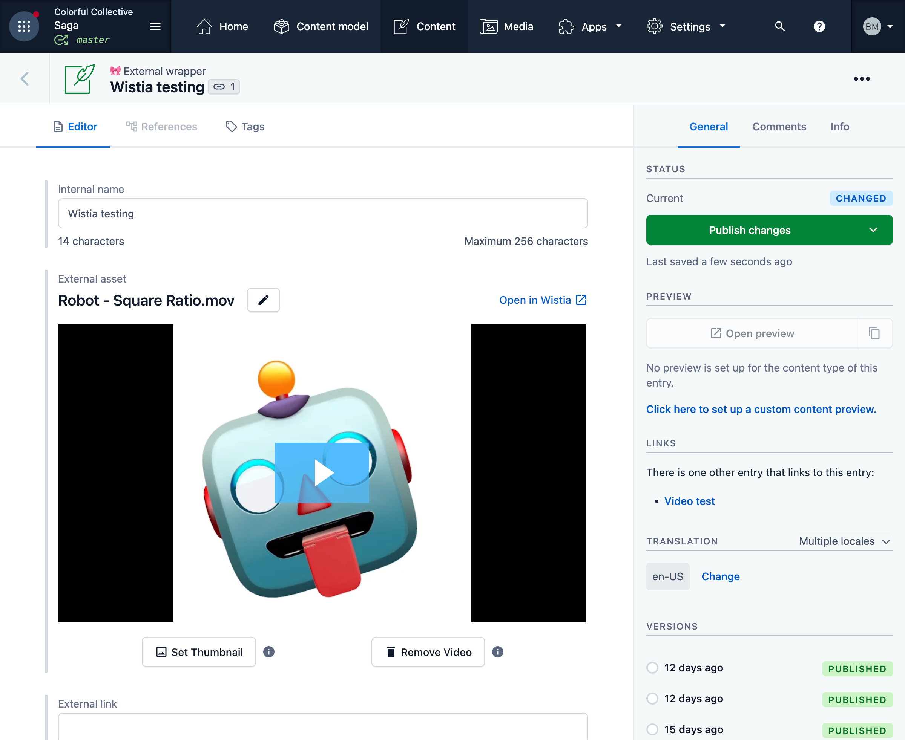

## Wistia Video

The goal of Wistia Video app is to help you to upload videos to Wistia service within Contentful.
You can use the app to add already uploaded videos as well.

* This project was bootstrapped with [Create Contentful App](https://github.com/contentful/create-contentful-app).
* UI is based on [Forma 36](https://f36.contentful.com/).
* Config screen is making use of the [@contentful/dam-app-base](https://github.com/contentful/apps/tree/master/packages/dam-app-base) library.
* For the upload functionality the app is using customized [Wistia Uploader](https://wistia.com/support/developers/uploader).


### App definition
App build can be found inside Colorful Collective organisation.

[](https://app.contentful.com/deeplink?link=apps&id=6X2tjK2ahnSGNFYUQVJrfi)

## Features

- [x] Upload video files to Wistia project
- [x] Browse and select videos available in Wistia project
- [x] Video preview for uploaded or selected file
- [x] Update the video name
- [x] Update the video thumbnail (by selecting different video frame)
- [x] Remove the video from Contentful entry

## Configuration

### Wistia Access Token
App requires Wistia API token to be set in the configuration screen.
- #### Private Wistia Account
  - API token can be generated in the [Wistia Account Settings](https://my.wistia.com/account/api).
  - You need the **Admin access to the Wistia account** to be able to generate the API token.
  - Make sure to select `Read, update, and delete anything` access.
- #### Contentful Wistia account 
  - Access token can be shared upon request or by creating a ticket for IT Support.
  
### Wistia Project ID
- App requires Wistia project ID to be set in the configuration screen.

### Contentful Field
App can only be used with JSON object fields.
  - You can assign the app to the field by ticking the checkbox of the field in the app configuration screen.
  - You can also assign the app manually by navigating to the field in the Content Model and selecting the app from the available editorial widgets.



## Nice to have
- [ ] Show video stats (visitors, plays, etc.)
- [ ] Validation of the Token and Project ID with Wistia API
- [ ] DAM app base library, configuration input masking (for token)

## Known issues
- [ ] Forma 36 `ModalConfirm` is not working properly. The modal is not showing up when the user clicks on action button. At the moment `sdk.dialogs.openConfirm` is used instead.
- [ ] When the video is selected from Wistia project and entry saved, if a user changes the video name in Wistia project, the name in Contentful entry is not updated.
- [ ] Wistia Uploader JSON response is not consistent with the response from Wistia API. The app is using the uploader response to get the hashed ID of the uploaded file and uses Wistia API to get the JSON object with the video data. This way regardless of which method was used to add the video to the entry (upload or select from Wistia project), the video data is always the same.
- [ ] When the user closes the browser window/tab while video is being uploaded, the upload is cancelled.

## Notes
- At the moment Wistia API does not support media replacement. This means that this feature is only available within Wistia project administration panel.
- Video that has been removed directly from Wistia project is not removed from Contentful entry. By default, Wistia API continues to return 200 status code even when the video is removed. The difference is in the response body. When the video is removed, the response body is empty. 
- When the video is removed from Contentful entry, the video is not removed from Wistia project. This is done to prevent accidental removal of the video from Wistia project. The user can always remove the video from Wistia project directly from the Wistia project administration panel.

## Frontend component
- Wistia Player example can be found in [frontend-example](./frontend-example) folder.
- This is not a part of the app build. It is only an example of how to use the Wistia video data in the frontend.

## Screenshots
### Initial state


### Video file uploading


### Browse and select video


### Video Preview Screen


## Feedback

Feedback is always welcome. If you have any questions or suggestions, please open an issue or a pull request.

## Available Scripts

In the project directory, you can run:

#### `npm start`

Creates or updates your app definition in Contentful, and runs the app in development mode.
Open your app to view it in the browser.

The page will reload if you make edits.
You will also see any lint errors in the console.

#### `npm run build`

Builds the app for production to the `build` folder.
It correctly bundles React in production mode and optimizes the build for the best performance.

The build is minified and the filenames include the hashes.
Your app is ready to be deployed!

#### `npm run upload`

Uploads the build folder to contentful and creates a bundle that is automatically activated.
The command guides you through the deployment process and asks for all required arguments.
Read [here](https://www.contentful.com/developers/docs/extensibility/app-framework/create-contentful-app/#deploy-with-contentful) for more information about the deployment process.

#### `npm run upload-ci`

Similar to `npm run upload` it will upload your app to contentful and activate it. The only difference is   
that with this command all required arguments are read from the environment variables, for example when you add
the upload command to your CI pipeline.

For this command to work, the following environment variables must be set:

- `CONTENTFUL_ORG_ID` - The ID of your organization
- `CONTENTFUL_APP_DEF_ID` - The ID of the app to which to add the bundle
- `CONTENTFUL_ACCESS_TOKEN` - A personal [access token](https://www.contentful.com/developers/docs/references/content-management-api/#/reference/personal-access-tokens)

## Libraries to use

To make your app look and feel like Contentful use the following libraries:

- [Forma 36](https://f36.contentful.com/) – Contentful's design system
- [Contentful Field Editors](https://www.contentful.com/developers/docs/extensibility/field-editors/) – Contentful's field editor React components

## Using the `contentful-management` SDK

In the default create contentful app output, a contentful management client is
passed into each location. This can be used to interact with Contentful's
management API. For example

```js
  // Use the client
  cma.locale.getMany({}).then((locales) => console.log(locales))

```

Visit the [`contentful-management` documentation](https://www.contentful.com/developers/docs/extensibility/app-framework/sdk/#using-the-contentful-management-library)
to find out more.

## Learn More

[Read more](https://www.contentful.com/developers/docs/extensibility/app-framework/create-contentful-app/) and check out the video on how to use the CLI.

Create Contentful App uses [Create React App](https://create-react-app.dev/). You can learn more in the [Create React App documentation](https://facebook.github.io/create-react-app/docs/getting-started) and how to further customize your app.